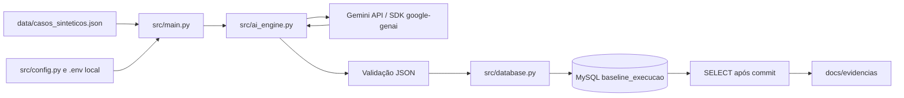

# Arquitetura mínima

A tabela guarda UUID, caso sintético, entrada JSON, resposta bruta, resposta JSON,
modelo, versão do prompt, hashes SHA256 e horário do servidor.
Não reutiliza classificacao, evitando misturar demonstração LLM com prognóstico clínico.
SQL parametrizado. Segredos somente por ambiente. Sem fallback que simule sucesso.
Falhas não recebem status de persistência confirmada.
